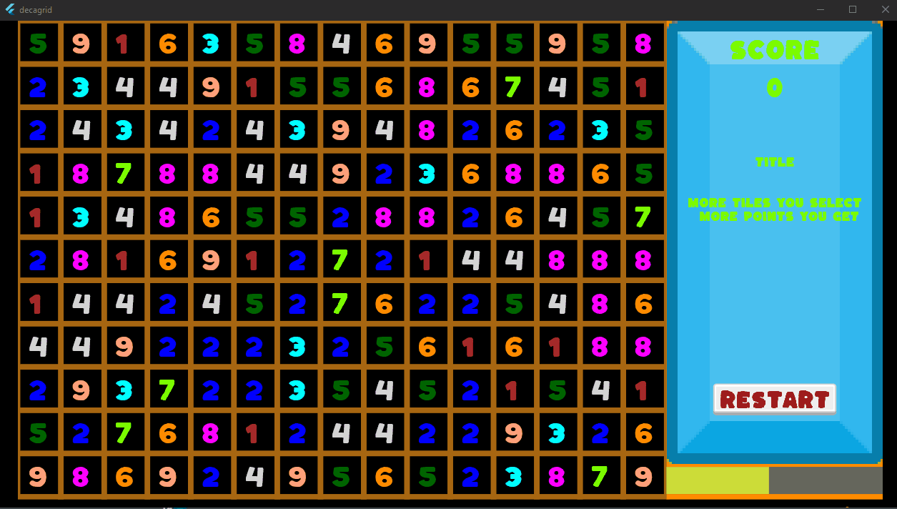

# Decagrid

Welcome to **Decagrid**, a strategic puzzle game that challenges your mind and reflexes!

### About the Game
Inspired by the popular "Make Ten" game on itch.io, **Decagrid** is built using Flutter and Flame. While maintaining the core mechanics that fans love, **Decagrid** introduces new rules to elevate the excitement and keep you on your toes.

### How to Play
- **Make 10:** Your goal is simple—select grids that sum up to the perfect 10.
- **More Grids, More Points:** The more grids you include in your selection, the higher your score. Yes, even empty grids can boost your points!
- **Watch Out for Penalties:** Choose carefully! If your selection doesn't add up to 10, you'll face the consequences.
- **Time is Ticking:** Start the game with 30 seconds on the clock.
- **Earn Extra Time:** Clear grids and earn an extra second for each one.
- **Beware the Countdown:** For each penalty, you lose a precious second.
- **Mind the Limit:** You can’t stack more than 60 seconds, so use your time wisely!

Ready to put your skills to the test? Dive into **Decagrid** and see how far you can go!

